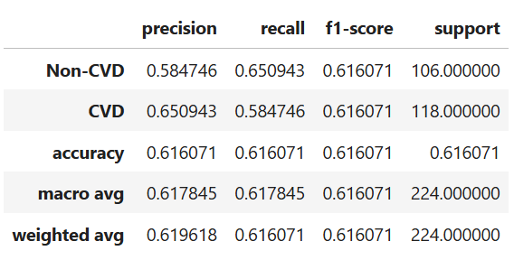

# Image Classification for Cattle CVD Detection via Retina Images

## Problem Statement
Cattle cardiovascular disease (CVD) can cause significant health and productivity issues, impacting the agricultural industry. This project aims to develop a machine learning model for the early detection of CVD using retinal images of cattle. By leveraging deep learning techniques, we can classify these images into CVD and Non-CVD categories, enabling faster and more accurate diagnoses.

## Dataset Description

### Source
The dataset used for this project is sourced from Kaggle: [CVD vs Non-CVD Retinal Images of Cattle](https://www.kaggle.com/datasets/animalbiometry/cvd-vs-noncvd-retinal-images-of-cattle).

### Structure
The dataset comprises retina images categorized into two classes:
- **CVD**: Images of cattle diagnosed with cardiovascular disease.
- **Non-CVD**: Images of healthy cattle.

### Dataset Challenges
1. **Inconsistency in Image Dimensions**: Retina images vary in size and resolution.
2. **Class Imbalance**: Uneven distribution of CVD and Non-CVD images.
3. **Noise in Images**: Variations in image clarity and lighting conditions.

### Preprocessing Techniques
To address the challenges, the following preprocessing steps were applied:
1. **Resizing**: All images were resized to a fixed shape (e.g., 224x224 pixels) to maintain consistency.
2. **Normalization**: Pixel values were scaled to the range [0, 1] for faster convergence.
3. **Data Augmentation**: Applied transformations to increase dataset variability and reduce overfitting:
   - Rotation
   - Horizontal/Vertical Flipping
   - Zooming
   - Brightness and Contrast Adjustments

## Methodology

### 1. Problem Approach
The problem of classifying retina images into CVD and Non-CVD categories was addressed using a Convolutional Neural Network (CNN). CNNs are well-suited for image classification tasks due to their ability to learn spatial hierarchies of features.

### 2. Model Architecture
The CNN architecture used in this project includes the following components:
- **Input Layer**: Accepts preprocessed images.
- **Convolutional Layers**: Extract spatial features using kernels.
- **Pooling Layers**: Reduce spatial dimensions and computational complexity.
- **Dropout Layers**: Prevent overfitting by randomly disabling neurons during training.
- **Fully Connected Layers**: Perform the final classification into CVD/Non-CVD categories.
- **Output Layer**: Uses a sigmoid activation function for binary classification.

## Evaluation Metrics
To assess the performance of the model, the following metrics were used:
1. **Accuracy**: Measures the percentage of correctly classified images.
2. **Precision**: Focuses on the proportion of true positive predictions among all positive predictions.
3. **Recall (Sensitivity)**: Emphasizes the model's ability to identify all positive cases.
4. **F1-Score**: Provides a balance between precision and recall.
5. **AUC-ROC Curve**: Evaluates the model's ability to distinguish between the two classes.

## Results

### Model Performance

### Grad-CAM Visualizations
To enhance model interpretability, Grad-CAM was used to visualize the areas of the retina that the model focused on while making predictions. These heatmaps provide insights into the decision-making process and help validate the model's reliability.

## Challenges and Solutions

1. **Data Imbalance**: The dataset had fewer samples for one class.
   - **Solution**: Applied data augmentation and weighted loss functions to mitigate imbalance.
2. **Overfitting**: The model showed signs of overfitting during training.
   - **Solution**: Implemented dropout layers and early stopping.
3. **Limited Dataset Size**: The dataset size was relatively small for training a CNN.
   - **Solution**: Experimented with transfer learning using pre-trained models like VGG16.

## How to Run the Project

### Requirements
- Python 3.8 or higher
- TensorFlow/Keras
- OpenCV
- Matplotlib
- NumPy
- Pandas
- Jupyter Notebook

## Future Work

### 1. Enhanced Interpretability
- Experiment with advanced interpretability methods such as:
  - **SHAP (SHapley Additive exPlanations)**: To understand the contribution of each feature to the model's predictions.
  - **LIME (Local Interpretable Model-agnostic Explanations)**: For localized and instance-specific explanations of predictions.

### 2. Deployment
- Deploy the trained model to a web application for practical usage:
  - **Flask**: Create a lightweight web service for model inference.
  - **Streamlit**: Develop an interactive and user-friendly interface to showcase predictions and visualizations.

### 3. Model Improvement
- Fine-tune hyperparameters using techniques such as grid search or random search.
- Test and implement state-of-the-art deep learning architectures:
  - **ResNet (Residual Networks)**: Known for solving vanishing gradient problems in deep networks.
  - **EfficientNet**: Offers better accuracy and computational efficiency.

### 4. Synthetic Data Generation
- Address dataset limitations by using **Generative Adversarial Networks (GANs)** to create synthetic retina images.
- This approach can help expand the dataset while preserving class distributions and improving model generalizability.

## Acknowledgments

- **Dataset**: Thanks to Kaggle contributors for providing the [CVD vs Non-CVD Retinal Images of Cattle dataset](https://www.kaggle.com/datasets/animalbiometry/cvd-vs-noncvd-retinal-images-of-cattle), which served as the foundation for this project.
- **Libraries**: Appreciation for the open-source tools and libraries used in this project:
  - **TensorFlow**: For building and training deep learning models.
  - **Keras**: For its user-friendly API and model creation.
  - **Matplotlib**: For data visualization and graphical representation.
  - **Grad-CAM**: For generating visual explanations of the model's predictions.

